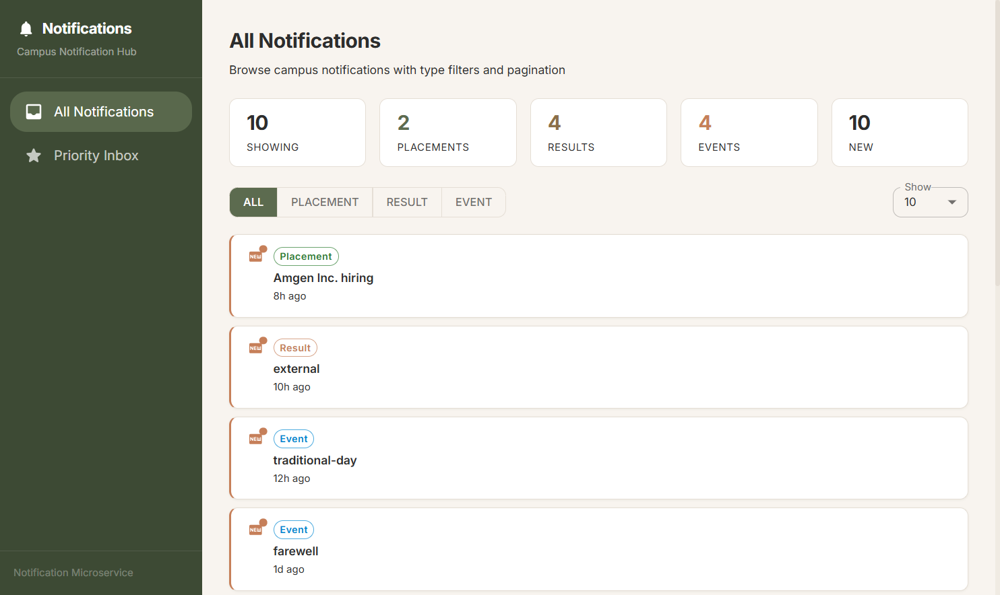
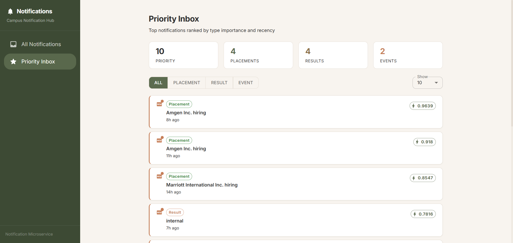
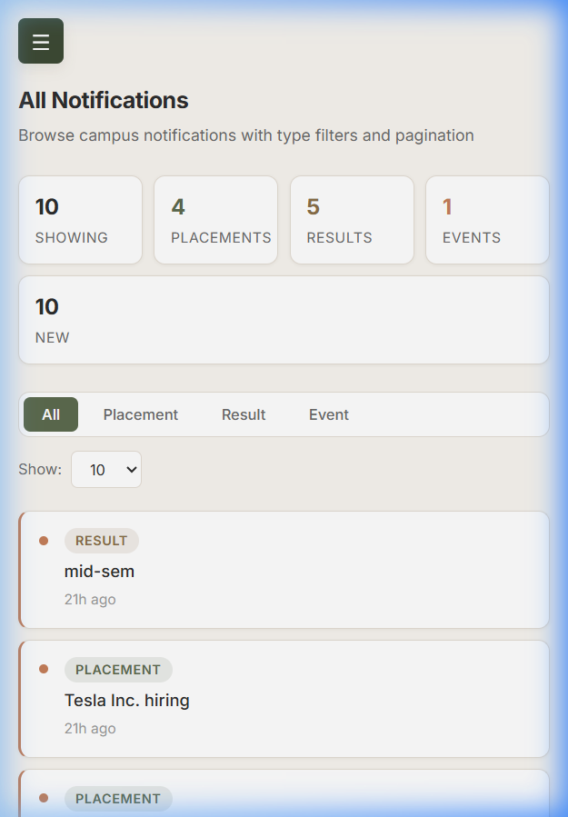
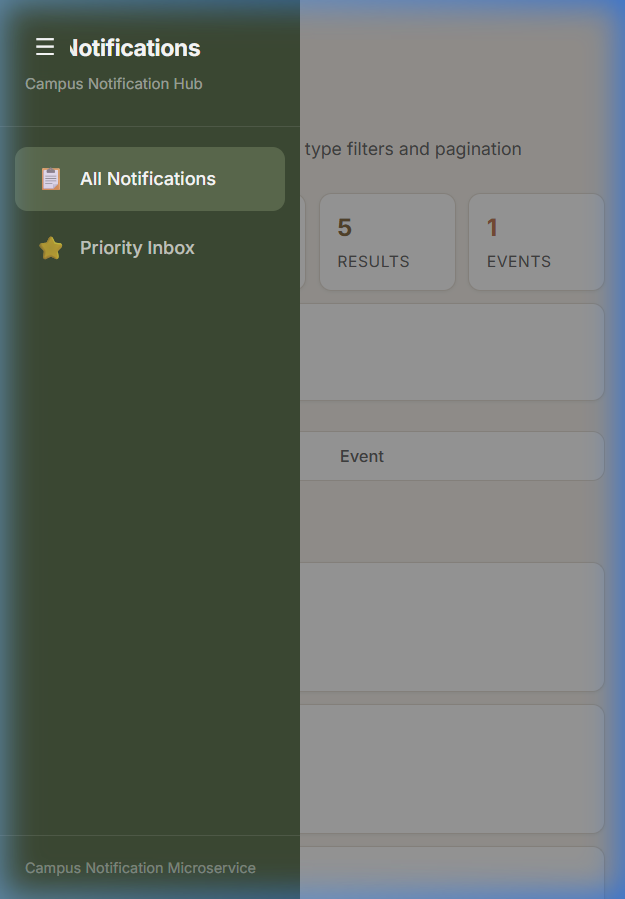
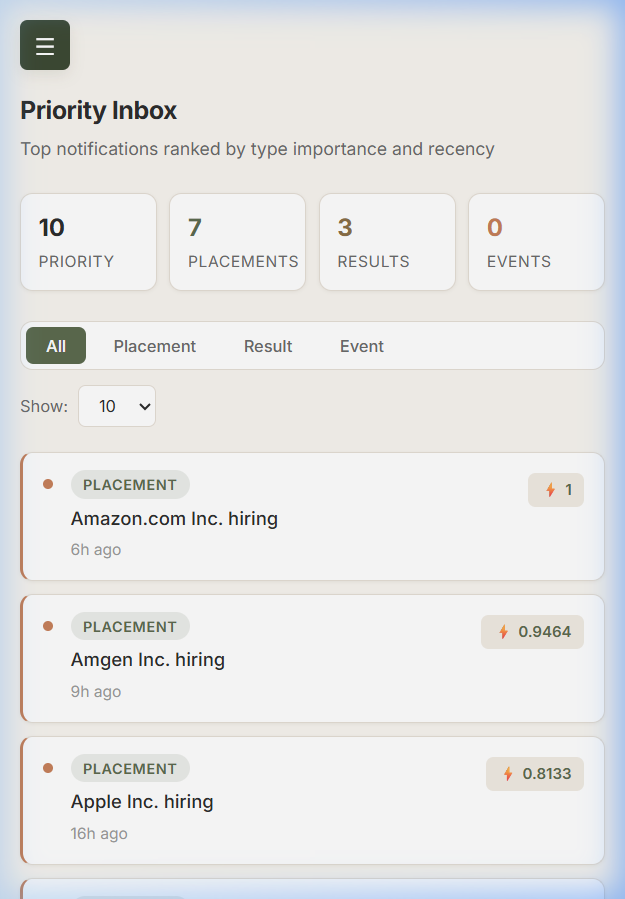

# Stage 1

## Notification System Design — Priority Inbox

### Problem Statement

Campus notifications span three categories — **Placement**, **Result**, and **Event**. With a high volume of notifications, users lose track of what matters. The goal: build a **Priority Inbox** that surfaces the top `N` most important items based on type and recency.

---

### Architecture

```
┌─────────────────────────────────────────────────┐
│               Priority Inbox                     │
│                                                   │
│  ┌──────────┐   ┌──────────────┐   ┌──────────┐  │
│  │ Fetcher  │──>│ Scoring      │──>│ Output   │  │
│  │          │   │ Engine       │   │          │  │
│  └──────────┘   └──────────────┘   └──────────┘  │
│       │                │                 │        │
│       v                v                 v        │
│  [GET /notifs]    [Composite]     [CLI / React]   │
│                                                   │
│  ┌───────────────────────────────────────────────┐│
│  │      Logging Middleware (cross-cutting)        ││
│  └───────────────────────────────────────────────┘│
└─────────────────────────────────────────────────┘
```

---

### Priority Scoring

Composite score combining two normalized dimensions:

```
score = (0.6 * typeScore) + (0.4 * recencyScore)
```

- **0.6** — Type importance is the primary factor
- **0.4** — Recency is secondary, also used for tiebreaking

#### Type Weights

| Type       | Weight | Normalized | Why                           |
|------------|--------|------------|-------------------------------|
| Placement  | 3      | 1.000      | Career-impacting, urgent      |
| Result     | 2      | 0.667      | Time-sensitive academics      |
| Event      | 1      | 0.333      | General information           |

#### Recency

Timestamps normalized to `[0, 1]` within the current batch:

```
recencyScore = (timestamp - min) / (max - min)
```

- `1.0` = most recent, `0.0` = oldest
- If all timestamps match, everyone gets `1.0`

#### Tiebreaking

Within `0.0001` tolerance, the more recent notification wins.

---

### Scaling Considerations

Current: **sort-and-slice** at `O(n log n)`, fine for batches under ~1000.

For streaming/larger volumes, a **min-heap of size N** would be better:

| Aspect | Sort (current) | Min-Heap         |
|--------|---------------|------------------|
| Time   | O(n log n)    | O(n log N)       |
| Space  | O(n)          | O(N)             |
| Best   | Small batches | Streaming data   |

---

### Module Structure

```
logging_middleware/
├── src/
│   ├── index.ts         # Log(stack, level, pkg, msg) entry point
│   └── auth.ts          # Token acquisition + caching
├── tsconfig.json
└── package.json

notification_app_be/
├── src/
│   ├── index.ts         # CLI entry — fetch, rank, display
│   ├── fetchNotifications.ts
│   ├── priorityEngine.ts
│   └── config.ts
├── tsconfig.json
└── package.json

notification_app_fe/
├── src/
│   ├── main.tsx         # React entry with MUI ThemeProvider
│   ├── App.tsx          # Router + responsive drawer layout
│   ├── theme.ts         # MUI createTheme — earthy palette
│   ├── index.css        # Minimal resets (scrollbar, nav active)
│   ├── types.ts
│   ├── services/
│   │   ├── auth.ts      # Browser token management
│   │   ├── api.ts       # Notification fetching + ranking
│   │   └── logger.ts    # Browser-side Log() using fetch
│   ├── hooks/
│   │   ├── useNotifications.ts
│   │   └── useViewedState.ts
│   ├── components/
│   │   ├── Sidebar.tsx        # MUI Drawer (permanent / temporary)
│   │   ├── FilterBar.tsx      # MUI ToggleButtonGroup + Select
│   │   ├── NotificationCard.tsx  # MUI Card, Chip, Badge
│   │   └── Pagination.tsx     # MUI Button navigation
│   └── pages/
│       ├── AllNotifications.tsx
│       └── PriorityInbox.tsx
├── demo/                # Screenshots and recordings
├── vite.config.ts
├── tsconfig.json
└── package.json
```

---

### Logging Strategy

The logging middleware is called at key decision points across both backend and frontend:

| Module          | Level | What gets logged                          |
|-----------------|-------|-------------------------------------------|
| controller      | info  | App start/stop, result counts             |
| service         | info  | Fetch start, response count               |
| service         | debug | Token status, timestamp range             |
| service         | error | HTTP errors, parse failures               |
| service         | fatal | Network unreachable                       |
| page            | info  | Filter changes, page navigation           |
| hook            | debug | Load params, result count                 |
| api             | error | Fetch failures                            |

---

### API Integration

**Auth API (POST)**
- `http://20.207.122.201/evaluation-service/auth`
- Body: `{ email, name, rollNo, accessCode, clientID, clientSecret }`
- Returns: `{ token_type, access_token, expires_in }`

**Notification API (GET)**
- `http://20.207.122.201/evaluation-service/notifications`
- Query params: `limit`, `page`, `notification_type`
- Notification types: `"Event"`, `"Result"`, `"Placement"`
- Auth: Bearer token header
- Returns: `{ "notifications": [{ ID, Type, Message, Timestamp }] }`

**Log API (POST)**
- `http://20.207.122.201/evaluation-service/logs`
- Body: `{ stack, level, package, message }`
- Auth: Bearer token header
- Returns: `{ logID, message }`

---

# Stage 2

## Frontend Implementation

### Tech Stack
- React 18 with TypeScript
- Vite dev server (port 3000)
- Material UI for component styling
- MUI custom theme with earthy color palette
- React Router for page navigation

### Pages

**All Notifications** (`/`)
- Paginated list with server-side `limit`/`page` params
- Type filter using MUI ToggleButtonGroup (Placement / Result / Event)
- Stats bar with MUI Paper cards showing counts by type
- New vs viewed distinction using localStorage
- MUI CircularProgress for loading, Alert for errors

**Priority Inbox** (`/priority`)
- Client-side ranking using composite scoring
- Configurable top-N (5/10/15/20) via MUI Select
- Priority scores displayed as MUI Chip on each card
- Same type filtering capability

### API Proxy

The frontend uses Vite's dev server proxy to avoid CORS issues:

```
Browser → localhost:3000/api/* → Vite proxy → 20.207.122.201/evaluation-service/*
```

The auth token is obtained in-browser and attached to every request.

### New vs Viewed

Notification IDs are tracked in `localStorage` under `viewed_notifs`. Clicking a notification marks it as viewed. New notifications show a MUI Badge dot indicator; viewed ones are dimmed with a check icon.

---

## Output Screenshots

### Desktop — All Notifications


### Desktop — Priority Inbox


### Mobile — All Notifications


### Mobile — Sidebar Navigation


### Mobile — Priority Inbox

